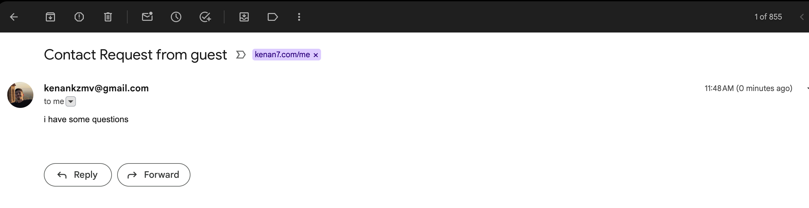
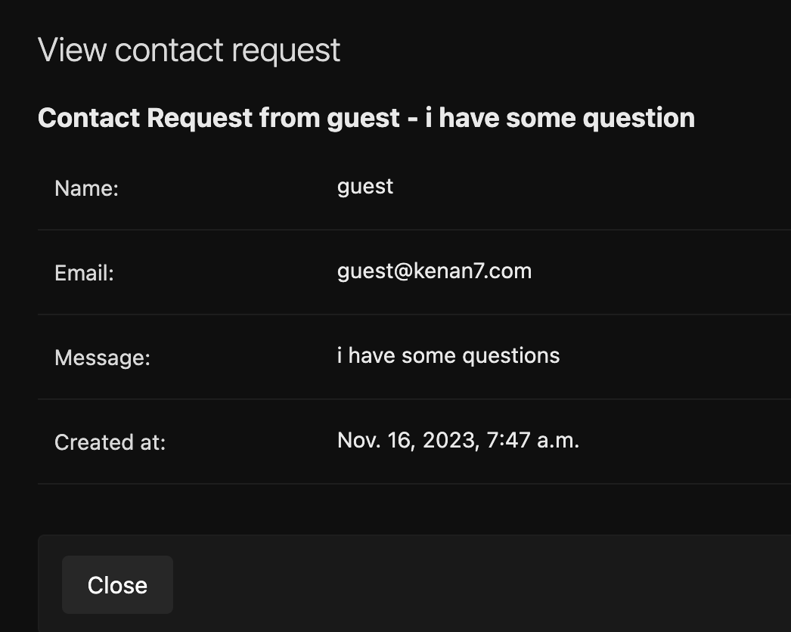

# Mir webpage

## Should have environment varialbes

You should definitely create `.env` file with following variables since this system relies on these configurations

```bash
DJANGO_SETTINGS_MODULE=mirblog.production_settings # must have
DJANGO_ALLOWED_HOSTS=mir.kenan7.com # change this to your own domain
CSRF_TRUSTED_ORIGINS=mir.kenan7.com

VIRTUAL_HOST=mir.kenan7.com # change this to your own domain

EMAIL_HOST=smtp.gmail.com # whicever email service you are using
EMAIL_PORT=587
EMAIL_HOST_USER=kenankzmv@gmail.com # change this to your email
EMAIL_HOST_PASSWORD=? # change this to your email password

CONTACT_FORM_SENDER=kenankzmv@gmail.com # who are you sending emails from
CONTACT_FORM_RECIPIENTS=debug@mir.de
```

## Deployment

Simple way to deploy is to install docker and start the containers

```bash
docker-compose up --build -d
```
If you encounter error with invalid http headers, you may have old docker engine version so just try the old build version

```bash
DOCKER_BUILDKIT=0 docker-compose up --build -d
```

## Development
```bash
python3.11 -m venv env # create virtual environment
pip install -r requirements.txt # install dependencies
python manage.py migrate # migrate database
python manage.py runserver # run server
```

## Tests

To run rests, simply run

```bash
python manage.py test
```

## Demo for the reviewers

### Proof that contact form works


### Proof that I got the email

